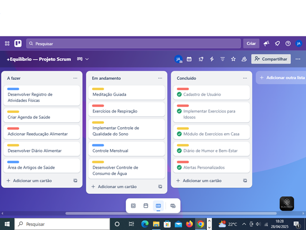

# 📱 +Equilíbrio - Gestão de Projeto com Metodologia Scrum

## Descrição do Projeto
Este repositório documenta a aplicação prática da metodologia ágil **Scrum** para o planejamento e gestão do projeto do aplicativo "+Equilíbrio". O objetivo do aplicativo é promover a saúde física e mental dos usuários, oferecendo acompanhamento de hábitos saudáveis, saúde emocional, reeducação alimentar, controle da saúde feminina e prática de exercícios físicos.

O foco deste projeto foi aplicar os conceitos de organização, priorização de atividades e controle de progresso utilizando ferramentas de gestão ágil, como o Trello.

---

## 💡 Habilidades Demonstradas
- **Metodologia Ágil (Scrum):** Prática na definição de papéis, *Sprints* e *User Stories*.
- **Gestão Visual:** Uso eficaz de ferramentas como Trello para organização e transparência do projeto.
- **Documentação:** Habilidade em criar relatórios técnicos e de gestão de escopo.
- **Priorização:** Experiência em definir e classificar funcionalidades (Product Backlog).

---

## 📋 Metodologia Utilizada
A metodologia ágil Scrum foi adotada para o desenvolvimento e gerenciamento deste projeto. As funcionalidades foram listadas e organizadas em um **Product Backlog**, com a definição de prioridades. O Trello foi utilizado para montar o Quadro Scrum, distribuindo as atividades nas colunas "A Fazer", "Em Andamento" e "Concluído", proporcionando uma visão clara do andamento do projeto.

## Funcionalidades Planejadas (Product Backlog)
A seguir, as principais funcionalidades que foram planejadas para o aplicativo, com suas respectivas prioridades:

| Funcionalidade | Descrição | Prioridade |
| :--- | :--- | :--- |
| Cadastro de Usuário | Permitir criação de perfil básico. | Alta |
| Controle de Consumo de Água | Registro diário da ingestão de água. | Alta |
| Controle de Qualidade do Sono | Registro dos horários de sono. | Média |
| Controle de Atividades Físicas | Registro das atividades realizadas. | Alta |
| Agenda de Saúde | Registro e lembrete de consultas médicas. | Média |
| Meditação Guiada | Sessões de relaxamento, foco e sono. | Alta |
| Exercícios de Respiração | Guias de respiração para ansiedade. | Alta |
| Diário de Humor e Bem-Estar | Registro diário de sentimentos. | Alta |
| Controle Menstrual | Calendário do ciclo menstrual. | Alta |
| Reeducação Alimentar | Sugestões de cardápios saudáveis. | Média |
| Diário Alimentar | Registro de refeições diárias. | Média |
| Exercícios em Casa | Guias de treinos sem academia. | Média |
| Exercícios para Idosos | Treinos adaptados para mobilidade. | Alta |

## 📊 Quadro Scrum (Trello)
Uma representação visual do Quadro Scrum utilizado para gerenciar as tarefas do projeto, estruturado em colunas "A Fazer", "Em Andamento" e "Concluído".

## 📄 Documentação Completa
Para detalhes adicionais sobre o projeto, incluindo a introdução, desenvolvimento, métodos e conclusão, consulte o relatório completo:

[Relatório Completo do Projeto +Equilíbrio](Relatorio_Scrum_MaisEquilibrio.pdf)

---

## ✨ Lições Aprendidas
Este projeto reforçou a importância da priorização de funcionalidades, da gestão visual no acompanhamento de projetos e da aplicação de metodologias ágeis como o Scrum para um fluxo de trabalho estruturado. Contribuiu significativamente para o aprendizado prático no contexto de desenvolvimento ágil.

---

Este projeto é um portfólio acadêmico, focado na fase de planejamento e gestão de software.
